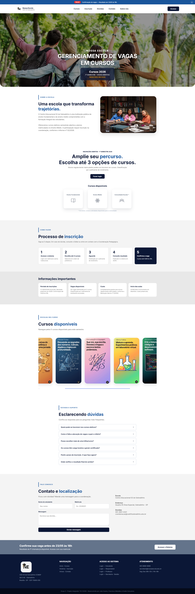
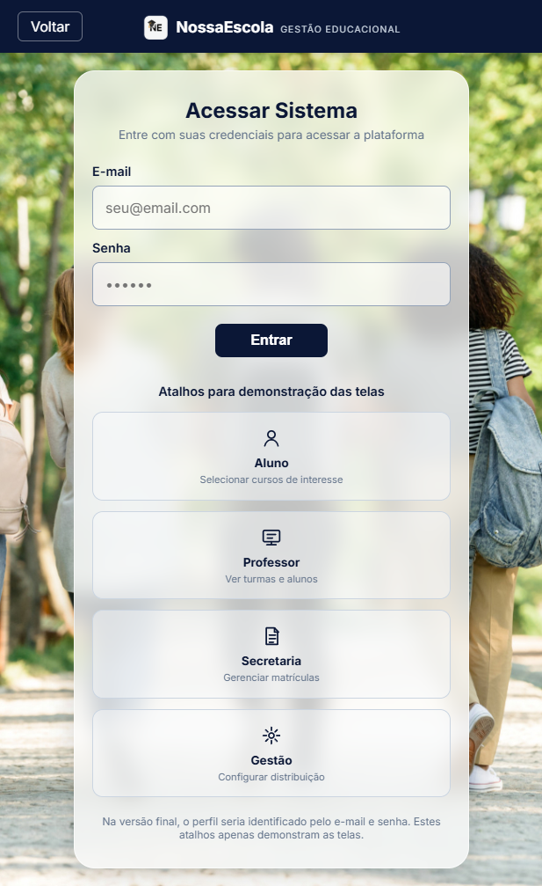
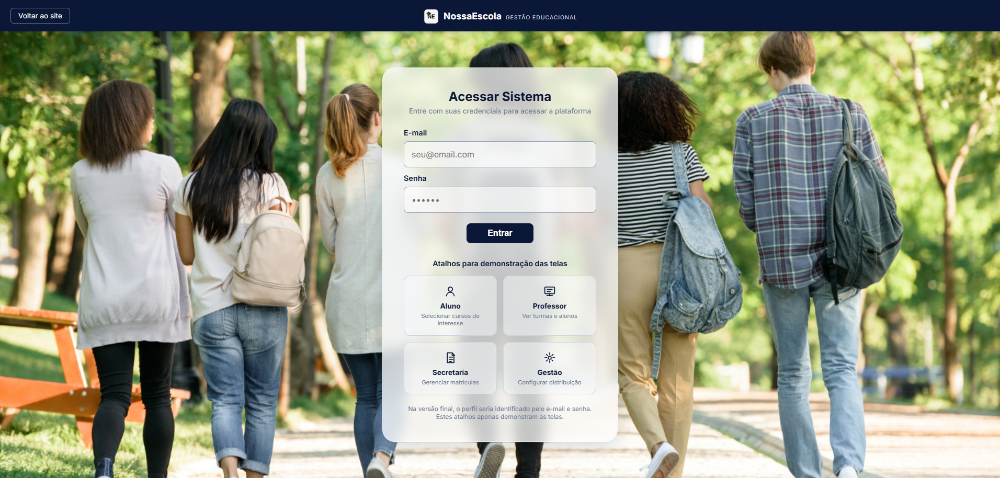
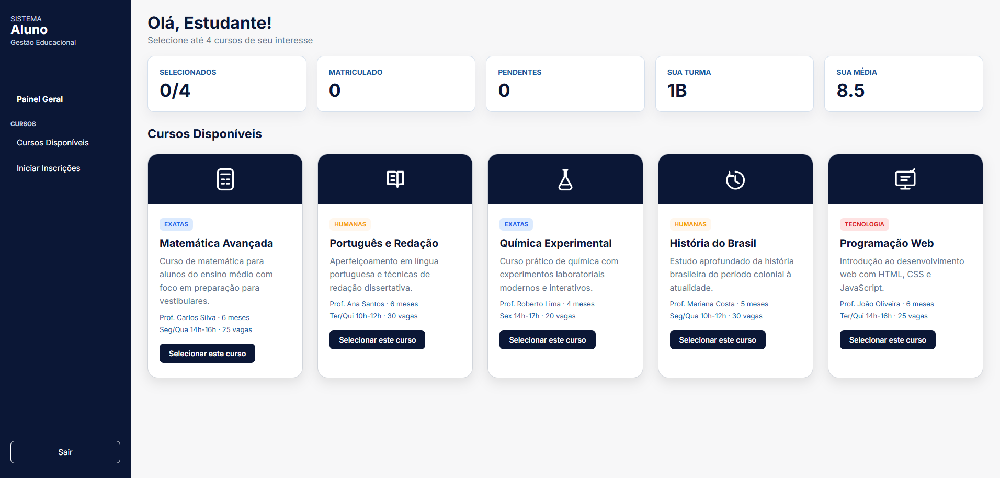
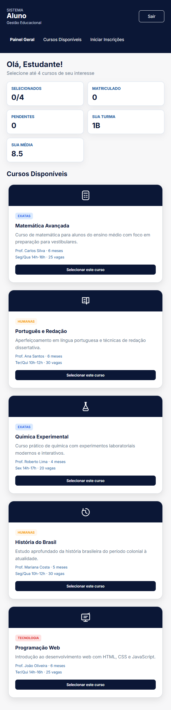
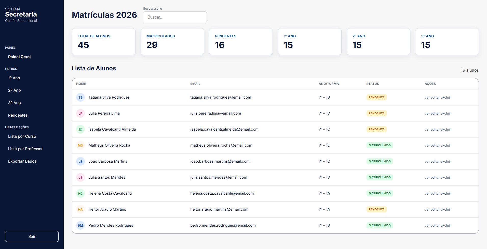

# Plataforma de Gestão de Vagas em Cursos Escolares

## Nome e descrição do projeto

Sistema web desenvolvido no Projeto Integrador I do Instituto Federal de Brasília (IFB) para apoiar a divulgação de cursos, o acompanhamento de inscrições e a gestão demonstrativa de vagas em cursos escolares, itinerários formativos, atividades extracurriculares e turmas de nivelamento.

Nesta Sprint 4, o projeto evoluiu da etapa de documentação e prototipação para uma primeira versão navegável do front-end, construída com HTML e CSS, mantendo coerência visual com o protótipo criado na Sprint 3.

---

## Público-alvo

A solução é voltada para a comunidade escolar do Centro Educacional 03 de Sobradinho, contemplando os seguintes perfis:

- **Estudantes:** consulta de cursos disponíveis, vagas, informações de inscrição e acompanhamento inicial do status acadêmico.
- **Secretaria:** apoio à consulta de estudantes, acompanhamento de matrículas e visão administrativa inicial.
- **Gestão/Coordenação Pedagógica:** acompanhamento do processo de oferta de cursos, prazos e distribuição de vagas.
- **Professores:** perfil previsto para acompanhamento de turmas em etapas futuras.
- **Pais ou responsáveis:** perfil previsto para acompanhamento de informações acadêmicas e comunicados.

---

## Integrantes

Grupo 3:

- Eraldo Dias
- João Soares
- Francisco Meirelles

Curso Superior de Tecnologia em Sistemas para Internet  
Instituto Federal de Brasília - IFB

---

## Tecnologias utilizadas

Na Sprint 4 foram utilizadas:

- HTML5
- CSS3
- Flexbox
- CSS Grid
- Media Queries para responsividade
- Figma para prototipação
- Git e GitHub para versionamento
- GitHub Pages para publicação da versão estática

Tecnologias previstas para evolução futura:

- JavaScript
- APIs REST
- Banco de dados
- Autenticação de usuários
- Back-end

---

## 📋 Levantamento de Requisitos
O levantamento de requisitos foi realizado com base na análise do público-alvo escolar (responsáveis, estudantes, professores e visitantes) e nas necessidades institucionais de comunicação e captação. A partir desse processo, identificou-se a demanda por uma interface limpa, moderna, totalmente responsiva e acessível, com foco na apresentação das etapas de ensino, mural de avisos dinâmico, galeria de atividades e formulário estruturado para contato direto com a secretaria e coordenação.

---

## ⚙️ Requisitos Funcionais (RF)

| ID | Requisito | Descrição |
| :--- | :--- | :--- |
| **RF01** | **Página Inicial Institucional** | O sistema deve exibir banners de destaque, apresentação breve da escola, comunicados recentes e atalhos rápidos para as áreas de maior interesse. |
| **RF02** | **Apresentação Institucional ("Sobre a Escola")** | O sistema deve disponibilizar histórico, missão, visão, valores, corpo docente e proposta pedagógica. |
| **RF03** | **Divulgação de Níveis de Ensino** | O sistema deve detalhar as etapas ofertadas (Educação Infantil, Ensino Fundamental, Ensino Médio/Técnico), grade curricular e horários de funcionamento. |
| **RF04** | **Mural de Notícias e Eventos** | O sistema deve listar comunicados oficiais, calendário escolar, feiras culturais e eventos com suporte a texto, data e imagens. |
| **RF05** | **Galeria de Mídia e Projetos** | O sistema deve disponibilizar álbuns de fotos e registros visuais de atividades pedagógicas, feiras de ciências e instalações físicas. |
| **RF06** | **Canal de Atendimento e Contato** | O sistema deve oferecer formulário com os campos: *Nome*, *E-mail*, *WhatsApp/Telefone*, *Setor/Assunto* e *Mensagem*. |
| **RF07** | **Acesso ao Portal do Aluno / Login** | O sistema deve conter botão de acesso direto ao ambiente restrito de boletim, frequência e comunicados individuais. |
| **RF08** | **Integração com Redes Sociais** | O site deve conter links de redirecionamento para as redes sociais oficiais da instituição (Instagram, Facebook, YouTube). |
| **RF09** | **Menu de Navegação Estruturado** | Apresentar menu superior responsivo dividindo as seções: *Início*, *Institucional*, *Ensino*, *Notícias*, *Galeria* e *Contato*. |

---

## 🔒 Requisitos Não Funcionais (RNF)

| ID | Categoria | Descrição |
| :--- | :--- | :--- |
| **RNF01** | **Desempenho** | O site deve carregar completamente em até 3 segundos em condições normais de conexão. |
| **RNF02** | **Segurança** | O portal deve operar integralmente sob o protocolo **HTTPS**, garantindo a integridade dos dados trafegados nos formulários. |
| **RNF03** | **Usabilidade e Identidade Visual** | A interface deve seguir padrão cromático e tipográfico institucional, com boa legibilidade, contraste adequado e feedback visual (*hover*) nos elementos interativos. |
| **RNF04** | **Responsividade e Acessibilidade** | O layout deve ser adaptável a dispositivos móveis (*Mobile First*), conter atributos `alt` em imagens e garantir navegação acessível. |
| **RNF05** | **Manutenibilidade** | Código limpo, modular e estruturado em HTML5 semântico, CSS3 e JavaScript organizado para facilitar expansões futuras. |
| **RNF06** | **Disponibilidade** | O sistema deve manter alta disponibilidade (meta de 99,5%), com interrupções restritas a manutenções programadas. |
| **RNF07** | **Portabilidade** | Compatibilidade assegurada com os principais navegadores modernos (Google Chrome, Firefox, Safari e Edge). |
| **RNF08** | **Conformidade (LGPD)** | Os dados coletados no formulário de contato devem ser tratados em conformidade com as diretrizes da Lei Geral de Proteção de Dados. |

---

## 🛠️ Tecnologias Utilizadas
- **HTML5** (Semântico e acessível)
- **CSS3** (Estilização moderna e responsiva)
- **JavaScript** (Interatividade e validações)
- **GitHub Pages** (Hospedagem e deploy)

---

## 🚀 Como Executar o Projeto

1. **Clone o repositório:**
   ```bash
   git clone [https://github.com/eraldogd/ne2.git](https://github.com/eraldogd/ne2.git)

## Como executar ou visualizar o front-end

### Opção 1 - GitHub Pages

Acesse a aplicação publicada:

[https://eraldogd.github.io/ne2/](https://eraldogd.github.io/ne2/)

### Opção 2 - Execução local

1. Baixe ou clone o repositório.
2. Abra a pasta da Sprint 4.
3. Acesse a pasta:

```text
SPRINT4/frontend/
```

4. Abra o arquivo abaixo em qualquer navegador moderno:

```text
index.html
```

5. Use o menu e os botões para navegar entre as páginas implementadas:

- `index.html`
- `login.html`
- `aluno.html`
- `secretaria.html`

---

## Pasta principal da aplicação

A versão entregue na Sprint 4 está organizada em:

```text
SPRINT4/frontend/
```

Estrutura principal:

```text
SPRINT4/
├── frontend/
│   ├── index.html
│   ├── login.html
│   ├── aluno.html
│   ├── secretaria.html
│   ├── css/
│   │   └── style.css
│   └── img/
│
├── docs/
│   └── Documentação_projeto_sprint4.docx
│
├── evidencias/
│   ├── prints das telas desenvolvidas
│   ├── descricao_basica_telas.docx
│   ├── descricao_basica_telas.pdf
│   ├── Mapa da Site.docx
│   └── Mapa da Site.pdf
│
├── Figma Protótipo/
└── README.md
```

---

## Link da documentação

A documentação atualizada da Sprint 4 está disponível em:

[Documentação do Projeto - Sprint 4](docs/Documentação_projeto_sprint4.docx)

---

## Link do Kanban

O acompanhamento das tarefas do grupo foi realizado em quadro Kanban:

[Quadro Kanban do Projeto](https://joaompsoares.atlassian.net/jira/software/projects/TSI/boards/2?atlOrigin=eyJpIjoiY2Y0OGFlODY0MjM5NGQ4NTgxYzlmMmZjM2U3ZjgyZmIiLCJwIjoiaiJ9)

---

## Link do protótipo

O protótipo de alta fidelidade desenvolvido na Sprint 3 foi utilizado como referência para a implementação da Sprint 4:

[Protótipo no Figma](https://www.figma.com/design/pBHRO07v3VpbDnkDaCd8YT/PROJETO-INTEGRADOR---NOSSA-ESCOLA?m=auto&t=EwNoevgP0TyD73fL-1)

Também há versões exportadas em PDF na pasta:

```text
SPRINT4/Figma Protótipo/
```

---

## Link da aplicação publicada

Aplicação publicada no GitHub Pages:

[https://eraldogd.github.io/ne2/](https://eraldogd.github.io/ne2/)

---

## Imagens das telas implementadas

As evidências visuais da Sprint 4 estão na pasta `SPRINT4/evidencias/`.

### Landing page



### Landing page - visão complementar/responsiva


### Tela de login



### Tela de login - visão responsiva



### Painel do estudante



### Painel do estudante - visão responsiva



### Painel da secretaria



---

## Telas e funcionalidades implementadas

### Landing page (`index.html`)

Página pública de divulgação do projeto, contendo:

- menu de navegação;
- alerta superior com fechamento em CSS;
- seção principal de apresentação;
- informações sobre a escola;
- processo de inscrição;
- vitrine de cursos disponíveis;
- dúvidas frequentes;
- formulário visual de contato;
- rodapé institucional.

### Login (`login.html`)

Tela de acesso ao sistema, contendo:

- formulário de e-mail e senha;
- botão de entrada;
- atalhos demonstrativos para as telas internas;
- explicação visual do fluxo de acesso.

Na versão final, o perfil do usuário será identificado pelo login. Nesta Sprint, os atalhos servem apenas para demonstrar as telas planejadas.

### Painel do estudante (`aluno.html`)

Tela interna demonstrativa para estudantes, contendo:

- menu lateral;
- indicadores do estudante;
- cards de cursos com informações completas;
- botões de seleção de curso;
- adaptação para visualização em telas menores.

### Painel da secretaria (`secretaria.html`)

Tela administrativa inicial, contendo:

- menu lateral;
- indicadores de matrícula;
- campo de busca;
- lista de alunos;
- status de matrícula.

---

## Situação atual do projeto

A Sprint 4 está concluída como implementação inicial do front-end. O projeto possui páginas navegáveis, estrutura organizada, documentação atualizada e evidências visuais das telas desenvolvidas.

O sistema ainda não possui back-end, autenticação real ou banco de dados. Os dados exibidos nas telas são demonstrativos e fixos, utilizados para validar o fluxo visual e preparar a apresentação final.

### Concluído na Sprint 4

- Implementação da landing page.
- Implementação da tela de login.
- Implementação do painel do estudante.
- Implementação do painel da secretaria.
- Organização dos arquivos em `SPRINT4/frontend/`.
- Ajustes de responsividade.
- Padronização visual em relação ao protótipo.
- Documentação atualizada.
- Evidências visuais das telas.

### Pendências e próximos passos

- Implementar autenticação real.
- Integrar banco de dados.
- Criar telas completas para professor, responsáveis e gestão.
- Transformar dados fixos em dados dinâmicos.
- Implementar regras reais de inscrição e distribuição de vagas.
- Ampliar testes com usuários reais.

---

## Licença e finalidade

Este projeto é parte do Projeto Integrador I do IFB e destina-se exclusivamente a fins educacionais.

Documento atualizado em junho de 2026 - Sprint 4.


